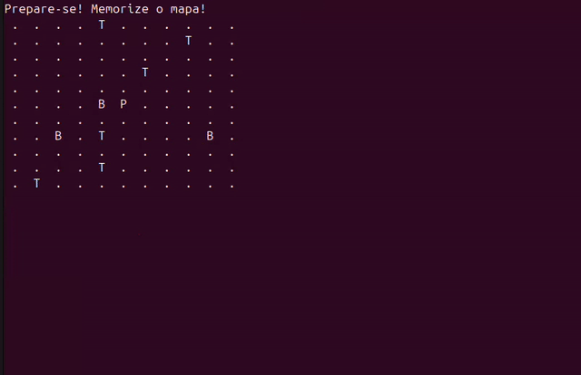

# ⚔️ Busca ao Tesouro



Este é um jogo de exploração desenvolvido em **C** como um projeto prático de estudos sobre manipulação de matrizes, lógica de movimentação e automação de compilação. O projeto foi inspirado no clássico **campo minado**💣🚩

## 🕹️ O Jogo

O jogador é colocado em um mapa 11x11, onde deve coletar tesouros escondidos enquanto evita bombas fatais. A lógica do jogo separa o "estado interno" da matriz da "visualização do jogador", criando um desafio de memória e estratégia.

### Funcionalidades:
* **Névoa de Guerra:** O mapa permanece oculto (representado por `.`), revelando apenas a posição atual do jogador (`P`).
* **Spoiler Flash:** Ao iniciar, o mapa revela a posição de todos os itens por 8 segundos antes de ocultá-los.
* **Geração Aleatória:** Tesouros e bombas são posicionados aleatoriamente a cada nova partida usando `srand(time(NULL))`.
* **Detecção de Colisão:** Sistema que verifica o conteúdo da célula antes de permitir a ocupação pelo jogador.
* **Makefile Universal:** Compilação automatizada para **Linux** e **Windows**.

## 🛠️ Tecnologias e Conceitos

* **Linguagem:** C
* **Compilador:** GCC
* **Ferramenta de Automação:** GNU Make
* **Conceitos de CC Aplicados:**
    * Matrizes bidimensionais e indexação.
    * Gerenciamento de buffer de entrada (`scanf`, `getchar`).
    * Manipulação de memória e limpeza de terminal.
    * Portabilidade de código entre sistemas operacionais.

## 🚀 Como Executar

O projeto conta com um **Makefile** que detecta seu Sistema Operacional automaticamente.

1.  **Compilar e Iniciar:**
    ```bash
    make run
    ```
2.  **Apenas Compilar:**
    ```bash
    make
    ```
3.  **Limpar Arquivos Binários:**
    ```bash
    make clean
    ```

## 🎮 Controles e Regras

* **W, A, S, D:** Movimentação (Cima, Esquerda, Baixo, Direita).
* **Q:** Desistir da partida.
* **Objetivo:** Coletar os 5 tesouros espalhados.
* **Derrota:** Pisar em qualquer uma das 3 bombas ocultas encerra o jogo imediatamente.

## 📁 Estrutura do Repositório

* `main.c`: Código-fonte principal do jogo.
* `Makefile`: Script de automação de compilação cross-platform.
* `.gitignore`: Configuração para evitar o envio de binários (`.exe` ou executáveis Linux) para o Git.

---

**Desenvolvido por Gabriela Gaspari** 🎓  
*Estudante de Ciência e tecnologia - UFABC*
